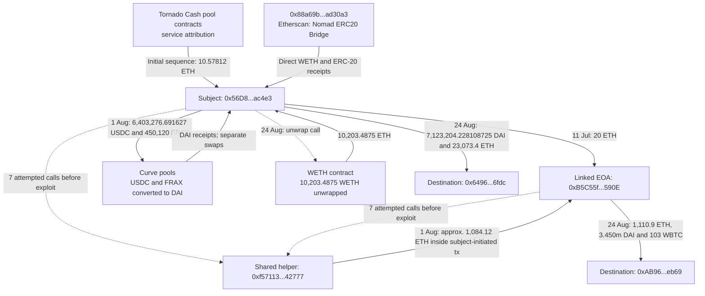

# Case 02 — Nomad Bridge Exploiter Investigation

## Executive Summary

This case traces funding, linked-wallet activity and asset consolidation around Ethereum address `0x56D8B635A7C88Fd1104D23d632AF40c1C3Aac4e3`. Etherscan's **Nomad Bridge Exploiter 1** label and Coinbase's identification of the first exploit transaction are third-party attribution, separate from the transaction evidence.

The original review reported **10.57812 ETH** in initial Tornado Cash pool receipts. A pre-exploit **20 ETH** transfer, shared-helper call attempts and approximately **1,084.12 ETH** delivered to linked address `0xB5C55f...590E` inside a subject-initiated transaction support a strong coordination hypothesis. They do not establish common ownership or a real-world identity.

The report traces stablecoin conversion into DAI and WETH unwrapping, followed on 24 August 2022 by **7,123,204.228108725 DAI** and **23,073.4 ETH** sent to `0x6496...6fdc`. The linked wallet sent **1,110.9 ETH**, **3,450,068.36980218776548975 DAI** and **103 WBTC** to `0xAB96...eb69`. Its ETH transfer followed the subject's by eight minutes and one second. These are historical observations, not current balance assertions.

The principal leads are the two destinations and shared helper infrastructure. No direct identified centralized-exchange destination was found in the original subject review; indirect cash-out remains unresolved.

**Reproducibility status:** the supplied CSVs were analyzed on 2 October 2026. Export counts and key ETH flows reproduce exactly; some internal and token table amounts agree only at display precision. The seven helper interactions per wallet include failed calls (successful calls: subject 1, linked 0). See [computed metrics](../analysis/case-02/results/metrics.md) and [evidence and methodology](../analysis/case-02/README.md).

---

## Transaction Flow

This schematic summarizes the original report. Solid arrows show reported transfers or conversions; dotted arrows show calls or contextual relationships, not fund transfers. Service names are externally attributed. Amounts are not additive across stages, and the diagram does not establish ownership or trace individual ETH units after commingling.

Full addresses and transaction hashes appear in the sections below and in the [evidence register](../analysis/case-02/README.md#evidence-register).

---

## Objective

Investigate the Ethereum address `0x56D8...ac4e3` and determine:

- its funding source
- major asset movements
- principal counterparties
- destinations of funds
- use of exchanges, mixers, and bridges
- identifiable transaction patterns
- the distinction between blockchain facts and third-party attribution
- practical investigative leads for follow-up

---

## Scope and Data Sources

Calculation rules, input requirements, verification status and the evidence register are documented in [Evidence / Reproducibility](../analysis/case-02/README.md). The [Python analysis script](../scripts/analyze_case_02.py) generates [source-hashed metrics and matching-row evidence](../analysis/case-02/results/metrics.json) from the supplied exports. The script does not infer identities or validate service labels.

The investigation used publicly available Ethereum blockchain data and third-party public attribution.

Primary datasets reviewed for the subject address:

- Etherscan Normal Transactions export — **111 transactions**
- Etherscan Internal Transactions export — **33 entries**
- Etherscan ERC-20 Token Transfers export — **43 events**
- Etherscan visible NFT transfers — **5 inbound airdrop events**
- Etherscan Cross-Chain Transactions view — **no matching entries**

Additional datasets reviewed for linked address `0xB5C55f...590E`:

- Etherscan Normal Transactions export — **101 transactions**
- Etherscan Internal Transactions export — **6 entries**

External attribution and infrastructure references included:

- Coinbase — *Nomad Bridge incident analysis*
- Tornado Cash community contract documentation
- Uniswap deployment documentation
- Etherscan public labels and transaction pages

Etherscan labels and Coinbase analytical conclusions are treated as third-party attribution, not as facts encoded in the blockchain.

---

## Initial Funding — Tornado Cash

The earliest internal ETH inflow identified for the subject occurred on **19 June 2022, 05:29:21 UTC**.

Amount: **0.07812 ETH**

From:

`0x12d66f87a04a9e220743712ce6d9bb1b5616b8fc`

Public Tornado Cash documentation identifies this as the Ethereum **0.1 ETH pool**.

The parent transaction was initiated by:

`0xd6187b4a0f51355a36764558d39b2c21ac12393d`

This is consistent with a relayed Tornado Cash withdrawal.

The internal-transaction dataset then shows five direct **0.1 ETH** inflows from the same 0.1 ETH pool, followed at **06:06:52 UTC** by a **10 ETH** inflow from:

`0x910cbd523d972eb0a6f4cae4618ad62622b39dbf`

Public Tornado Cash documentation identifies this as the Ethereum **10 ETH pool**.

Observed Tornado Cash inflows in this initial sequence totaled **10.57812 ETH**.

Blockchain records establish that the subject received ETH from known Tornado Cash pool contracts. They do **not** identify the original deposit address corresponding to the withdrawn Tornado notes.

---

## Pre-Exploit Activity and Linked Address

A key linked address is:

`0xB5C55f76F90cC528B2609109CA14D8D84593590E`

Etherscan labels it **Nomad Bridge Exploiter 3**. That label is third-party attribution.

On **11 July 2022, 06:05:34 UTC**, the subject transferred **20 ETH** to this address.

Transaction:

`0x497e6ad285bd85551a1b2dbeb4e9504bb10ff11f8e0325166e7e5241ee69b82a`

Before the exploit transaction on 1 August, both addresses repeatedly attempted calls to:

`0xf57113D8f6Ff35747737f026fE0B37D4D7f42777`

Within the reviewed Normal Transactions datasets:

- the subject attempted **7 calls before the exploit**: 1 successful and 6 error-marked
- `0xB5C55f...590E` attempted **7 calls before the exploit**, all error-marked

The attempt counts demonstrate repeated targeting of shared infrastructure. They do not establish seven successful executions by either wallet.

In addition, `0xB5C55f...590E` created:

`0xB88189cd5168C4676bD93E9768497155956F8445`

on 5 July 2022. Coinbase later included that contract among its published indicators for the initial Nomad exploiters.

These facts materially strengthen the hypothesis that the addresses were coordinated or part of a common operational cluster. They do not independently prove common ownership.

---

## First Exploit Transaction and Proceeds Linkage

On **1 August 2022, 21:32:31 UTC**, the subject initiated:

`0x61497a1a8a8659a06358e130ea590e1eed8956edbd99dbb2048cfb46850a8f17`

The transaction was sent to helper contract:

`0xf57113D8f6Ff35747737f026fE0B37D4D7f42777`

### Blockchain fact

The newly supplied linked internal table displays **1,084.12 ETH** for this event. The longer amount retained below is from the original review and fits that rounding; the supplied file does not reproduce its full precision.

The internal-transaction history of `0xB5C55f...590E` shows that, within this parent transaction, the helper contract transferred **1,084.116533510535209745 ETH** to `0xB5C55f76F90cC528B2609109CA14D8D84593590E`.

The parent transaction originated from the subject address.

### Third-party attribution

Coinbase's published Nomad incident analysis identifies the same transaction as the **first active exploitation transaction** in block 15,259,101 and states that it took **100 WBTC**, exchanged the assets through Uniswap, used helper contract `0xf57113...42777`, and was submitted privately using Flashbots.

Coinbase also reported that the first three exploiter addresses were funded through Tornado Cash and had actively transacted with one another, which Coinbase interpreted as indicating a single actor group.

That conclusion is third-party analysis. This case study independently confirms several of the underlying on-chain relationships but does not convert the "single actor group" assessment into a proven identity fact.

---

## Major ERC-20 Asset Receipts

The supplied 43-row ERC-20 table export shows substantial direct receipts from:

`0x88a69b4e698a4b090df6cf5bd7b2d47325ad30a3`

Etherscan labels this address **Nomad: ERC20 Bridge**.

| Asset | Direct amount received |
| --- | ---: |
| WETH | 10,200 |
| USDC | 2,062,150.84 |
| FRAX | 300,080 |
| DAI | 150,040 |
| FXS | 12,502.96 |
| CQT | 37,514,864.72 |

These amounts are calculated from explorer token display labels because this subject export has no ContractAddress column; that token-identity limitation remains explicit.

Additional assets reached the subject through helper or intermediary contracts during the same exploit window, so these figures represent direct receipts from the labeled bridge contract rather than total exploit-related accumulation.

---

## Stablecoin Consolidation

The supplied subject ERC-20 table export omits token contract addresses and rounds several amounts to two decimal places. The original longer amounts below remain historical-review values, compatible with the supplied display precision but not independently reproduced to every digit. See the [evidence register](../analysis/case-02/README.md#evidence-register).

On **1 August 2022, 23:33:03 UTC**, the subject sent **6,403,276.691627 USDC** to Curve's DAI/USDC/USDT pool:

`0xbebc44782c7db0a1a60cb6fe97d0b483032ff1c7`

and received approximately **6,401,967.149834 DAI**.

Transaction:

`0xaf05b7e78a414a44b2b96c8ceee3ca718df2582bd6193b31f21cb4dbbd9fcbb1`

On **1 August 2022, 23:42:02 UTC**, the subject sent **450,120 FRAX** to:

`0xd632f22692fac7611d2aa1c0d552930d43caed3b`

and received approximately **449,809.37754 DAI**.

Transaction:

`0x7212506377a4cbcda9145216ba49e227135ed7655e24d8ce5a6931ceab9e2350`

These transactions reduced multiple stablecoin exposures into a single major DAI position. This is consistent with **asset consolidation**, although blockchain data alone does not establish motive.

---

## WETH to ETH Consolidation

On **24 August 2022, 13:55:24 UTC**, the subject called the WETH contract and received **10,203.4875 ETH** through an internal transfer from the Wrapped Ether contract.

Parent transaction:

`0x92c5b78c4e480e04cbbe186c8294bb5a1927cbcad1ff346a86bccdf34c71fe29`

---

## Principal Destination — `0x6496...6fdc`

Destination:

`0x649614d3f7A7d68b3Cf3C00264a07eeae4326fdc`

On **24 August 2022, 14:00:54 UTC**, it received **7,123,204.228108725 DAI**.

Transaction:

`0x976b2c819e5ac3f64623268146df04f5d577f2f6ea30810ba2ead7d325f993f4`

At **14:05:58 UTC**, it received **23,073.4 ETH**.

Transaction:

`0xfd243724371bea1221d1bd9d8e6755656ef697d594e97a46ca21ca3390ae7fe1`

The same destination therefore received the subject's two largest consolidated liquid positions within approximately five minutes.

The supplied 63-row normal export contains **no transactions initiated by this destination**. Its full ERC-20 export records **7,123,204.228108725107069601 DAI** from the subject in the cited transaction. The original balance observation was approximately 23,073.401 ETH; it is not a current balance check.

The address is appropriately described as a **destination / consolidation / parking address**. There is insufficient evidence to call it a centralized exchange, mixer, bridge, independently controlled third party, or definitively same-owner wallet.

---

## Linked Address — `0xB5C55f...590E`

On **24 August 2022, 14:12:35 UTC**, the linked address unwrapped **300 WETH → 300 ETH**.

At **14:13:59 UTC**, it transferred **1,110.9 ETH** to:

`0xAB96E9AE52351f27Ff9aCE45ac2cB7083044eb69`

Transaction:

`0xc98e586f49bbedeebd9809d582fb3f8d2ac89df08f60326bde54b4ddd79a53e6`

The supplied 49-row normal export contains **no transactions initiated by `0xAB96...eb69`**. The original approximately 1,110.901 ETH balance observation is not a current balance check.

The linked wallet also transferred to this destination on 24 August 2022:

| UTC | Asset | Amount | Transaction |
| --- | --- | ---: | --- |
| 14:16:31 | DAI | 3,450,068.36980218776548975 | [DAI transfer](https://etherscan.io/tx/0x8a43d2aa015eb6bc24bdf541915f1e0d193c6ba1208c70d1d003efce399c9f4f) |
| 14:18:21 | WBTC | 103 | [WBTC transfer](https://etherscan.io/tx/0xffd3bc46060c2fc5b211bb191da3009aa25a4ab487e5d5498dbf3b35a8d4bd18) |

Both amounts are reproduced from contract-address-bearing ERC-20 exports. Each destination export also contains one outward-looking token event (361 units of an unclassified token for the primary; zero WBTC for the secondary). These events alone do not establish controller activity or material cash-out; see [methodology limitations](../analysis/case-02/README.md#calculation-rules-and-limitations).

The subject's 23,073.4 ETH transfer and the linked address's 1,110.9 ETH transfer occurred about **8 minutes 1 second apart** on the same day.

Timing alone would be weak evidence. Here, it appears alongside a direct pre-exploit 20 ETH transfer, repeated shared helper-contract call attempts, direct receipt by the linked address of ETH generated inside the subject's first exploit transaction, and similar WETH unwrap and bulk-transfer behavior.

---

## Use of Mixers, Exchanges, DEXs, and Bridges

### Mixer — Tornado Cash

**Confirmed.**

The subject received ETH through known Tornado Cash pool contracts and directly called the Tornado Cash Router.

The review did not identify a direct post-exploit Tornado Cash cash-out by the subject.

### Centralized exchanges

**No direct identified CEX destination in the reviewed subject dataset.**

This does not exclude unlabeled exchange deposit addresses, OTC settlement, indirect routing, later exchange deposits from destination addresses, or off-chain settlement.

### Uniswap

**Confirmed DEX infrastructure.**

Coinbase reports that the first exploit transaction exchanged 100 WBTC through Uniswap. The subject also interacted with Uniswap's `SwapRouter02` address:

`0x68b3465833fb72A70ecDF485E0e4C7bD8665Fc45`

### Curve

**Confirmed.**

The subject used Curve's DAI/USDC/USDT pool to convert approximately 6.403m USDC into approximately 6.402m DAI.

### Frax / Curve

**Confirmed.**

The subject used the FRAX/3CRV pool to convert 450,120 FRAX into approximately 449,809 DAI.

### Bridges

The subject interacted extensively with Nomad bridge infrastructure during exploit activity.

Etherscan's separate Cross-Chain Transactions view returned **no matching entries**, but Etherscan notes that this view supports only a limited set of bridges. The absence of entries is therefore not proof that no other bridge activity occurred.

---

## NFT and Other Asset Checks

The visible NFT activity consisted of **5 inbound NFT transfer events**, all displayed as inbound airdrops.

No visible outbound NFT transfer was identified, and no evidence was found that NFTs were used as a material value-transfer channel by the subject.

Etherscan also warned that suspicious, unsafe, spam, or brand-infringement token activity may be hidden under default settings.

---

## Transaction Pattern Assessment

The subject's activity can be divided into five phases:

1. **Privacy-preserving funding** — multiple Tornado Cash withdrawals.
2. **Pre-exploit infrastructure activity** — repeated shared helper-contract call attempts and a direct 20 ETH transfer to a linked EOA.
3. **Exploit-related acquisition** — subject initiates the transaction Coinbase identifies as the first active Nomad exploitation transaction, followed by large asset receipts.
4. **Asset conversion and consolidation** — USDC and FRAX converted into DAI; WETH later unwrapped into ETH.
5. **Delayed bulk transfer and passive storage** — 7.123m DAI and 23,073.4 ETH moved to one destination; linked EOA moved 1,110.9 ETH to another passive destination minutes later.

This behavior is consistent with deliberate consolidation and parking of assets. That is an analytical assessment of transaction behavior, not proof of criminal intent or common ownership.

---

## Blockchain Facts vs. Third-Party Attribution

### Blockchain facts

The blockchain directly establishes transaction hashes, addresses, timestamps, transaction ordering, transferred amounts, smart-contract interactions, token-transfer events, internal ETH transfers, and contract-creation transactions.

Examples include:

- Tornado Cash pool inflows
- the 20 ETH transfer to `0xB5C55f...590E`
- repeated call attempts to `0xf57113...42777`, including failed transactions
- initiation of `0x61497a...8f17`
- the 1,084.1165 ETH internal transfer to `0xB5C55f...590E`
- direct token receipts from `0x88a69b...ad30a3`
- Curve and FRAX/3CRV swaps
- final 7.123m DAI and 23,073.4 ETH transfers

### Third-party attribution

External attribution includes:

- Etherscan label **Nomad Bridge Exploiter 1**
- Etherscan label **Nomad Bridge Exploiter 3**
- Etherscan label **Nomad: ERC20 Bridge**
- Coinbase identification of `0x61497a...8f17` as the first active Nomad exploit transaction
- Coinbase's statement that the transaction stole 100 WBTC and swapped it through Uniswap
- Coinbase's assessment that the first three addresses indicated a single actor group

These claims are useful and, in several instances, consistent with independently observed on-chain evidence. They are not equivalent to proof of a person's identity.

---

## Limitations

Important limitations include:

- Supplied CSVs reproduce export counts and key flows, but display-rounded table exports cannot validate all original decimal digits. The subject token export lacks contract addresses.
- Supplied files were received on 2 October 2026; exact collection settings and the original review cutoff were not independently recorded. Destination normal-transaction inactivity is bounded by these exports; historical balances are not current checks.
- Unprovided destination Internal Transactions are zero according to the investigator's manual check, without a machine-verifiable zero-row CSV.
- Token event From fields do not alone establish signed transactions or beneficial ownership.

- Tornado Cash breaks deterministic linkage between deposits and withdrawals.
- The original depositor behind a withdrawal note cannot be established from the reviewed withdrawal transaction alone.
- Etherscan labels are third-party attribution.
- Coinbase conclusions are third-party analysis.
- Hidden spam/suspicious and zero-value token events were not the focus of the primary ERC-20 review.
- Etherscan's cross-chain tracker supports only a limited set of bridges.
- No exchange-side account records, KYC records, IP logs, or device records were available.
- A lack of a recognized exchange label does not prove that no exchange was used.
- ETH is fungible; specific ETH units cannot be followed coin-by-coin after commingling.
- Similar timing and transaction structure can support clustering but do not alone prove common control.
- Current balances and labels can change after the review date.

---

## Practical Investigative Leads

### 1. Monitor the two parking destinations

Primary:

`0x649614d3f7A7d68b3Cf3C00264a07eeae4326fdc`

Secondary:

`0xAB96E9AE52351f27Ff9aCE45ac2cB7083044eb69`

Any future outbound transaction could reveal a centralized exchange, bridge, mixer, OTC or service endpoint, or another consolidation layer.

### 2. Expand the pre-exploit wallet cluster

Priority addresses:

- `0xB5C55f76F90cC528B2609109CA14D8D84593590E`
- `0xf57113D8f6Ff35747737f026fE0B37D4D7f42777`
- `0xB88189cd5168C4676bD93E9768497155956F8445`

Useful follow-up work includes contract-creator analysis, shared funding analysis, repeated timing patterns, common counterparties, gas-funding relationships, and deployment timing.

### 3. Investigate the earliest relayed Tornado withdrawal

Earliest parent-transaction sender:

`0xd6187b4a0f51355a36764558d39b2c21ac12393d`

Relayer usage should not be treated as ownership evidence, but timing, denomination, and candidate deposit windows may provide additional context.

### 4. Extend cross-chain analysis

A dedicated multi-chain analytics platform could search bridge contracts not covered by Etherscan, wrapped-asset mint/burn events, destination-chain activity, and later movement by linked addresses.

### 5. Seek exchange-side records if a regulated endpoint is identified

If funds later reach a regulated exchange or custodian, lawfully obtained records could potentially establish account ownership, KYC details, deposit attribution, withdrawal destinations, and IP/device information.

---

## Key Evidence Timeline

| UTC | Event |
| --- | --- |
| 19 Jun 2022 05:29 | Earliest identified 0.07812 ETH Tornado Cash inflow |
| 19 Jun 2022 05:35–05:50 | Five additional 0.1 ETH Tornado Cash inflows |
| 19 Jun 2022 06:06 | 10 ETH Tornado Cash inflow |
| 11 Jul 2022 06:05 | Subject sends 20 ETH to `0xB5C55f...590E` |
| Jul 2022 | Both principal EOAs repeatedly attempt calls to shared helper `0xf57113...42777` |
| 1 Aug 2022 21:32 | Subject initiates `0x61497a...8f17` |
| same transaction | 1,084.1165 ETH reaches `0xB5C55f...590E` from helper |
| 1 Aug 2022 22:24–23:25 | Large WETH/stablecoin/CQT/FXS receipts |
| 1 Aug 2022 23:33 | ~6.403m USDC → ~6.402m DAI via Curve |
| 1 Aug 2022 23:42 | 450,120 FRAX → ~449,809 DAI |
| 24 Aug 2022 13:55 | Subject unwraps 10,203.4875 WETH |
| 24 Aug 2022 14:00 | 7.123m DAI → `0x6496...6fdc` |
| 24 Aug 2022 14:05 | 23,073.4 ETH → `0x6496...6fdc` |
| 24 Aug 2022 14:12 | Linked EOA unwraps 300 WETH |
| 24 Aug 2022 14:13 | Linked EOA sends 1,110.9 ETH → `0xAB96...eb69` |
| 24 Aug 2022 14:16 | Linked EOA sends 3,450,068.36980218776548975 DAI to same destination |
| 24 Aug 2022 14:18 | Linked EOA sends 103 WBTC to same destination |

---

## Key Transaction References

- [Initial Tornado Cash withdrawal](https://etherscan.io/tx/0x7829d0c74abe327a89feb6e771266c44df7e272826bab7fe4776c2166825d24c)
- [20 ETH pre-exploit transfer](https://etherscan.io/tx/0x497e6ad285bd85551a1b2dbeb4e9504bb10ff11f8e0325166e7e5241ee69b82a)
- [First exploit transaction identified by Coinbase](https://etherscan.io/tx/0x61497a1a8a8659a06358e130ea590e1eed8956edbd99dbb2048cfb46850a8f17)
- [USDC → DAI Curve swap](https://etherscan.io/tx/0xaf05b7e78a414a44b2b96c8ceee3ca718df2582bd6193b31f21cb4dbbd9fcbb1)
- [FRAX → DAI swap](https://etherscan.io/tx/0x7212506377a4cbcda9145216ba49e227135ed7655e24d8ce5a6931ceab9e2350)
- [7.123m DAI destination transfer](https://etherscan.io/tx/0x976b2c819e5ac3f64623268146df04f5d577f2f6ea30810ba2ead7d325f993f4)
- [23,073.4 ETH destination transfer](https://etherscan.io/tx/0xfd243724371bea1221d1bd9d8e6755656ef697d594e97a46ca21ca3390ae7fe1)
- [1,110.9 ETH linked-wallet destination transfer](https://etherscan.io/tx/0xc98e586f49bbedeebd9809d582fb3f8d2ac89df08f60326bde54b4ddd79a53e6)

---

## External References

- [Coinbase — Nomad Bridge incident analysis](https://www.coinbase.com/blog/nomad-bridge-incident-analysis)
- [Tornado Cash community documentation — Smart contract addresses](https://github.com/tornadocash-community/docs/blob/en/general/tornado-cash-smart-contracts.md)
- [Uniswap Developers — Ethereum deployments](https://developers.uniswap.org/docs/protocols/v3/deployments/v3-ethereum-deployments)

---

## Conclusion

The reviewed Ethereum data shows that the subject address was funded through Tornado Cash, established direct and infrastructure-level links to another address before the Nomad incident, participated in the transaction Coinbase identifies as the first active exploit transaction, accumulated large quantities of ETH and ERC-20 assets, consolidated major stablecoin positions into DAI, unwrapped WETH into ETH, and ultimately moved its two largest liquid positions to one passive destination address.

The strongest linked EOA, `0xB5C55f...590E`, was connected to the subject before the exploit, received 1,084.1165 ETH inside the subject's first exploit transaction, and later exhibited a similar consolidation-and-parking pattern within minutes of the subject's own major asset transfer.

The evidence supports a **strong wallet-cluster hypothesis** involving the subject, the linked EOA, and shared helper infrastructure.

It does **not** independently prove the real-world identity of the controller, that all linked addresses were controlled by the same natural person, the ultimate beneficial owner of the parked assets, or a direct cash-out through a centralized exchange.

Further progress would most likely come from future movement of the parking addresses, broader cluster analysis, dedicated cross-chain tracing, or lawfully obtained service-provider records.

---

## Skills Demonstrated

- Ethereum blockchain exploration
- normal transaction analysis
- internal transaction analysis
- ERC-20 transaction analysis
- NFT activity review
- mixer-funding analysis
- transaction tracing
- wallet clustering
- counterparty analysis
- smart-contract interaction analysis
- bridge-exploit tracing
- DEX and liquidity-pool analysis
- asset-conversion analysis
- temporal analysis
- behavioral pattern analysis
- destination-address analysis
- CSV-based blockchain data analysis
- third-party attribution assessment
- evidence-vs-attribution separation
- investigative hypothesis development
- limitations analysis
- practical investigative lead development
- analytical reporting

